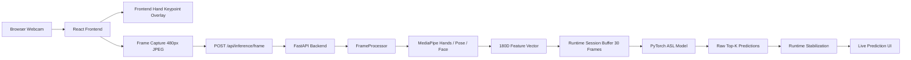

# ASL AI Platform

`asl-ai-platform` is a full-stack real-time American Sign Language recognition platform built around an existing production ASL sequence model. This repository is the application and runtime layer: FastAPI backend, React frontend, live webcam experience, runtime stabilization, and product-facing integration logic.

This repo is intentionally separate from the older ASL research and training repo. The model contract stays the same, while the platform focuses on live inference usability, deployment shape, and frontend/backend orchestration.

## What This Project Does

- opens a browser webcam feed
- shows live hand keypoints in the frontend
- captures frames continuously while the camera is on
- converts valid hand-present frames into `180D` feature vectors in the backend
- maintains a rolling `30`-frame temporal buffer
- runs the real production ASL model on `1 x 30 x 180`
- applies runtime stabilization, idle handling, and transition holds
- returns stabilized live sign output to the UI

## Current Capabilities

- FastAPI backend with lightweight `/health`
- React + Vite frontend for live webcam recognition
- production checkpoint loading
- MediaPipe-based backend preprocessing
- browser-side keypoint overlay for low-latency visual feedback
- hot background buffering while the camera is on
- real model inference with rolling `30`-frame session state
- stabilization logic ported from the older live runtime
- idle and no-hands safety behavior
- latency and runtime metrics in Advanced details

## Not Included Yet

- authentication
- WebSockets / streaming transport
- Docker deployment
- sentence-level translation
- TTS
- persistent session storage

## Architecture Diagram



## Runtime Flow

1. The user clicks `Start Camera`.
2. The frontend starts the webcam and immediately begins background frame submission.
3. The backend processes hand-present frames into `180D` vectors and warms the rolling `30`-frame buffer.
4. The user clicks `Start Recognition`.
5. Recognition uses the current hot buffer instead of starting from zero.
6. Once `30` valid frames are available, the backend runs the production temporal model.
7. Raw Top-K outputs pass through stabilization logic before becoming the main displayed result.
8. Brief hand loss enters `holding_context`; longer loss clears stale state and returns `waiting_for_hands`.

## Model Contract

The platform preserves the existing production model assumptions:

- sequence length: `30`
- input dimension: `180`
- feature layout:
  - hands: `126`
  - pose: `21`
  - face: `33`
- checkpoint path: `backend/models/asl_wlasl300_realtime.pt`

This project does not retrain the model, change the checkpoint, or alter the `180D` feature order.

## Project Structure

```text
asl-ai-platform/
├── backend/
│   ├── app/
│   │   ├── api/
│   │   ├── core/
│   │   ├── ml/
│   │   ├── schemas/
│   │   └── services/
│   ├── artifacts/
│   ├── models/
│   ├── scripts/
│   ├── README.md
│   └── requirements.txt
├── docs/
│   ├── ARCHITECTURE.md
│   ├── CHANGELOG.md
│   ├── COMPONENT_ANATOMY.md
│   └── INTEGRATION_PLAN.md
├── frontend/
│   ├── src/
│   ├── README.md
│   ├── package.json
│   └── vite.config.js
└── README.md
```

## Setup

### Backend

From the repository root:

```powershell
python -m venv .venv
.\.venv\Scripts\Activate.ps1
pip install -r backend\requirements.txt
uvicorn app.main:app --app-dir backend --reload
```

Backend URL:

```text
http://127.0.0.1:8000
```

### Frontend

From the `frontend/` directory:

```powershell
npm install
npm run dev
```

Frontend URL:

```text
http://127.0.0.1:5173
```

## Main API Routes

- `GET /health`
- `POST /api/inference/mock`
- `POST /api/inference/frame-debug`
- `POST /api/inference/frame`
- `POST /api/inference/reset-session`

## Live Recognition UX

- `Start Camera`
  - starts webcam
  - starts background buffering immediately
- `Start Recognition`
  - switches into active recognition mode
  - uses the current hot buffer
- `Stop Recognition`
  - pauses recognition output
  - preserves the buffer while the camera stays on
- `Stop Camera`
  - stops webcam
  - clears session state
- `Reset`
  - clears the active backend session

## Performance Notes

Current live capture is tuned for lower latency:

- capture interval: `100ms`
- capture width: `480px`
- capture format: `image/jpeg`
- JPEG quality: `0.6`

The backend also reuses pose and face landmarks across short strides while still running hand detection every frame.

## Why This Repo Is Separate

The older ASL repo remains the research and model-development source. This platform repo exists so the application can evolve independently:

- frontend UX and product behavior
- API boundaries
- runtime stabilization
- latency profiling
- deployment-oriented structure

That keeps training code, datasets, and experiments out of the main product repo.

## Documentation

- [Architecture](docs/ARCHITECTURE.md)
- [Integration plan](docs/INTEGRATION_PLAN.md)
- [Changelog](docs/CHANGELOG.md)
- [Component anatomy](docs/COMPONENT_ANATOMY.md)
- [Backend guide](backend/README.md)
- [Frontend guide](frontend/README.md)

## Roadmap

1. Continue refining live inference responsiveness and UX.
2. Add a more streaming-oriented transport layer when needed.
3. Add containerization and environment-specific deployment setup.
4. Add CI, automated browser checks, and broader runtime regression coverage.
